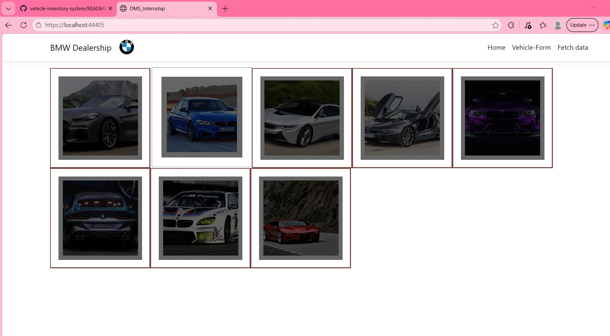
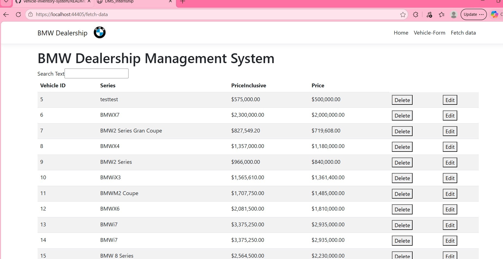
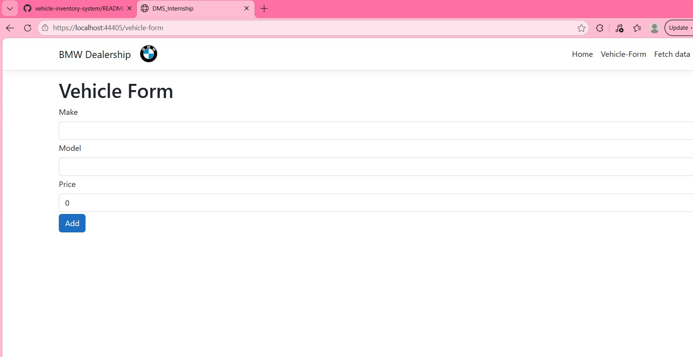
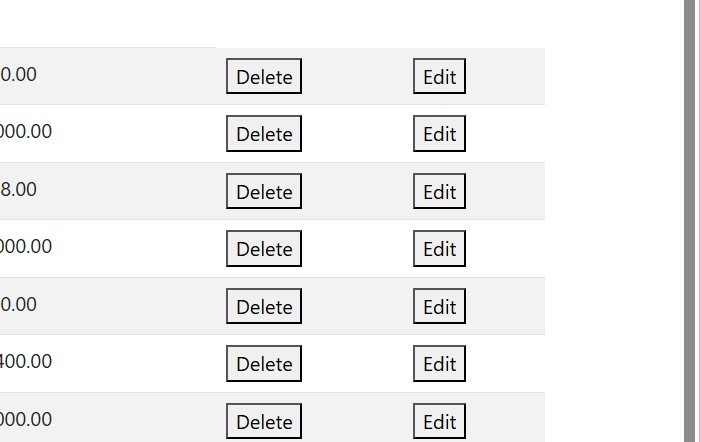
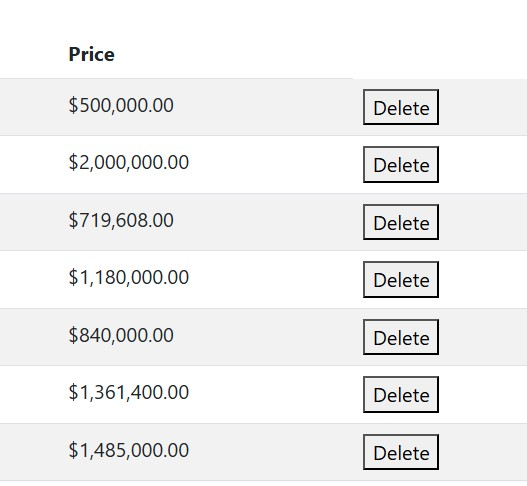
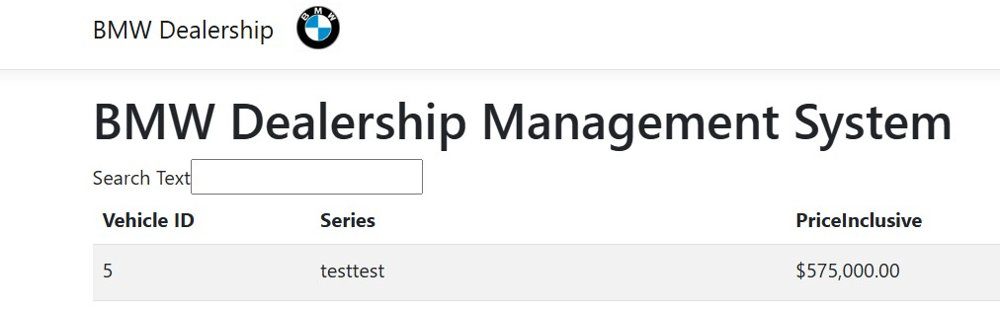

**Project Title:** Dealership Management System (DMS)

**Objective:** To create a comprehensive Dealership Management System that allows for the management of a dealership's vehicle stock. Users should be able to view, add, edit, and remove vehicles

**Home Page**

## Features

- **View Inventory** — Browse all vehicles in a clean, tabular layout

- **Add Vehicle** — Submit a form to add new vehicles to the dealership's stock

- **Edit Vehicle** — Update existing vehicle details

- **Delete Vehicle** — Remove vehicles from inventory via a dedicated delete button

- **Search/Filter** — Quickly find vehicles in the inventory table using the built-in search functionality

- **Error Handling** — Graceful handling of common API errors (400, 404, 500) with clear user-facing messages


### **Detailed Specifications**

#### **1. GitHub Repository Setup:**
   - Make a GitHub account and create a new repository.
   - Implement a GitHub Project Kanban Board for task management.
   - Ensure that Pull Requests (PRs) are utilized for code reviews.

#### **2. Backend (C# ASP.NET WebAPI):**
   - **API Endpoints:**
      - HTTP GET: Retrieve vehicle information.
      - HTTP POST: Add new vehicle.
      - HTTP PUT: Update vehicle information.
      - HTTP DELETE: Remove a vehicle.
   - **Database Management:**
      - Utilize Dapper for object-relational mapping.
      - Implement SQLite for the database.
      - Utilize T-SQL for managing database queries.
   - **Unit Tests (TDD Approach):**
      - Ensure there is no duplication of data.
      - Ensure that price calculations are accurate, considering the VAT.

#### **3. Frontend (Angular UI):**
   - **Display:**
      - Vehicles should be listed in a table.
      - Users should be able to view all vehicles per dealership.
   - **Functionalities:**
      - Add, Edit, and Remove vehicles from the dealership’s list.
      - Implement a search/filter feature for the vehicles' table.
   - **Extra Features:**
      - Error Handling: Implement proper error messages (400, 404, 500).

#### **4. Documentation and Technical Report:**
   - Properly document the project.
   - A technical report detailing the architecture and workflow of the application should be produced.

### **Milestones and Tasks Breakdown**

1. **Project Initialization:**
   - Setup GitHub Repository and Project Board.

2. **Backend Development:**
   - Database and API Setup.
   - Develop and Test API Endpoints.
   - Implement Unit Testing.

3. **Frontend Development:**
   - Design the UI layout.
   - Implement the functionalities: CRUD operations, search/filter.

4. **Documentation:**
   - Complete the documentation and the technical report.
   - Review and finalize all project documents.

### **Technology Stack**
- Backend: C# with ASP.NET WebAPI
- Database: SQLite with Dapper ORM
- Frontend: Angular
- Version Control: Git & GitHub
- Project Management: GitHub Project Board

### **Expected Outcome**
A fully functional Dealership Management System with backend API, responsive Angular front end, and detailed documentation.

## Getting Started

### Prerequisites
- [.NET SDK](https://dotnet.microsoft.com/download)
- [Node.js and npm](https://nodejs.org/)
- Visual Studio (recommended) or any C#/Angular-compatible IDE

### Running the project

1. Clone the repository:
```bash
   git clone https://github.com/KatlegoSikhosana/vehicle-inventory-system.git
```

2. Open `VehicleInventorySystem.sln` in Visual Studio.

3. Install frontend dependencies:
```bash
   cd VehicleInventorySystem/ClientApp
   npm install
```

4. Run the solution (`F5` in Visual Studio, or `dotnet run` from the backend project folder). The Angular frontend will launch alongside the API.

## My Contribution

This project was completed with a classmate as part of a school internship module. My focus areas included [fill in — e.g. backend API development, database schema design, the search/filter feature, etc.].

## Project Management

Development was tracked using a GitHub Projects Kanban board, with feature work reviewed via Pull Requests before merging into the main branch.
